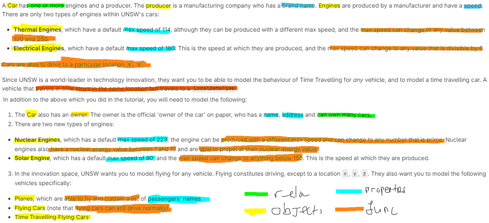

Task 1

- A car has one or more engines
- A car has a producer whereas a producer 
- Engines are produced by manufacturer and have a speed
- Thermal engines will have a default speed of 114 and max speed can change between 100 & 250
- Electrical engines will have a default speed of 180 and max speed can change to any value that is divisible by 6
- Cars are able to drive to a particular location x,y
- Car has an owner
- The owner has a name, address and can own many cars
- Nuclear engines have a default speed of 223 and can produced with a different max speed and can change to any number that is prime
- Nuclear engines also have a nuclear energy value between 1 to 10 and are able to propel at their nuclear energy value
- Solar engines will have a default speed of 90, max speed can change to anything below 150
- Planes are able to fly and contain list of passengers' names
- Flying cars can drive and fly
- Time travelling flyng cars can time travel, drive and fly
Task 2

.png>)
Reflections
I create a class Car contains these private attributes:
- engines
- localDateTime
- fly
- producer
for method I have drive method and attributes' getter and setter.

Then TimeTravellingCar, FlyingCar, Planes will be a subclass of Car with extra fly method.
These classes will have an inheritance relationship with class Car since they are different type of cars.

I create a class Engine contains these private attributes:
- speed
- producer
for method I have getter and setter for those attributes. This class will have 1 to 1..* Aggregation relationship with class Car. It is 1 to 1..* since a car can have 1 or more engines

Then I created Thermal, Nuclear, Electrical and Solar Engines class, these classes will have an inheritence relationship with engine since they are different type of engines

I create a class Owner contains these private attributes:
- name
- address 
- carList
for method I have getter and setter for these attribute. This class will have 1 to 0..* Association relationship with class Car since 1 owner can own 0 or more cars

I create a class Manufacturer contains 1 attribute brandName and for method I have getter and setter for this attribute.
This class will have 1 to 0..* Association relationship with class Car and 1 to 0..* Composition relationship with class Engine. This is beacause 1 owner can own 0 or more cars and 1 manufacturer can produce 0 or more engines

I create a class Passenger conatains 2 attributes name and list of passenger. As for method I have addPassenger to add all the passengers into a list.
This class will have 0..* to 1 Association relationship with class Plane since it could be many passengers on 1 plane.

During the design, I also have some difficulty in thought process when should we use aggregation, compositon and association
